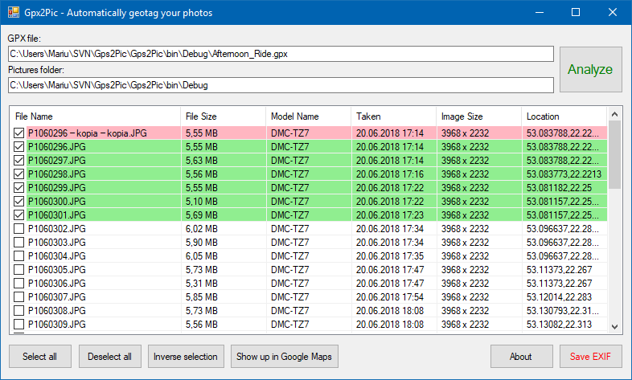
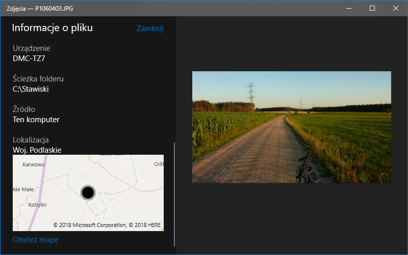

# Gpx2Pic
Automatically geotag your photos.

## How it works?
1. Select your GPX file, eg. from Strava or Wahoo Fitness and choice folder with photos.
2. Click Analyze button for preview.
3. The program will find nearest track point by timestamp (we take into account your local time zone and the maximum error margin of 5 minutes).
4. Click Save EXIF to update EXIF data in your photos.

## Dependencies
We use some dependencies, which are not imported to repository (from NuGet and external sites):
- ExifTool by Phil Harvey,
- ExifLib by Simon McKenzie,
- Windows API Code Pack by rpastric.

If you are a beginner, just download executable files from releases tab.

## Summary
This project was made for private use in 3 days, so please be understanding.