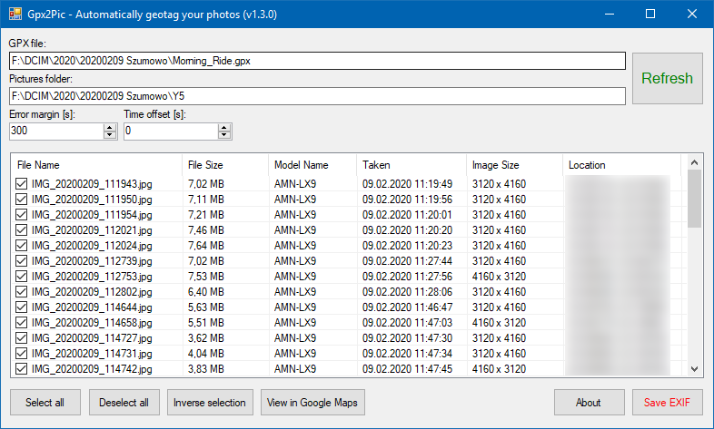

# Gpx2Pic
Automatically geotag your photos.

## How it works?
1. Select your GPX or FIT file, eg. from Strava or Wahoo Fitness and select folder with photos.
2. Click the Save EXIF to update EXIF data.

The program will find nearest track point by timestamp.

## Dependencies
We use some dependencies, which are not imported to repository (from NuGet and external sites):
- ExifTool by Phil Harvey,
- ExifLib by Simon McKenzie,
- Windows API Code Pack by rpastric,
- GPX by dlg.krakow.pl,
- FastFitParser John Lam,
- Dynamically Sizing Columns by Nick Olsen.

If you are a beginner, just download executable files from releases tab.
